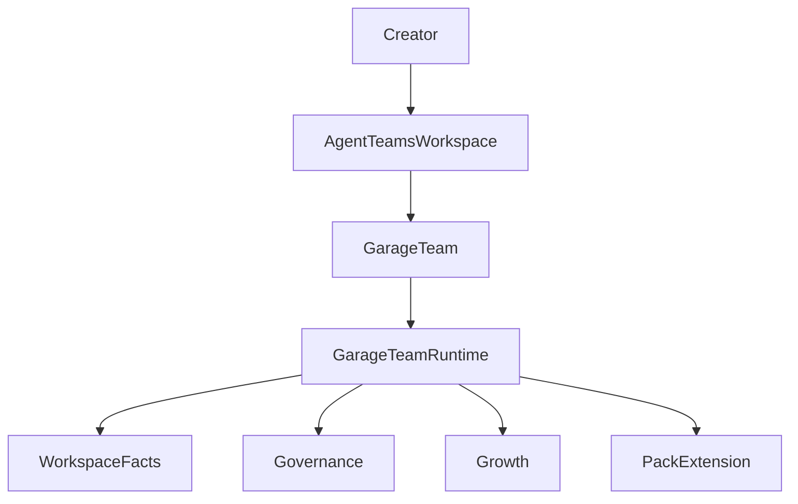

# 1: Garage System Overview

- Architecture Level: `L0`
- 状态: 草稿
- 日期: 2026-04-11
- 定位: 这份文档回答一个问题：当 `Garage` 被视为一个辅助创作者的 `Agent Teams` 工作环境时，它的最小完整系统故事是什么。
- 关联文档:
  - `docs/VISION.md`
  - `docs/GARAGE.md`
  - `docs/architecture/2-garage-runtime-reference-model.md`
  - `docs/ROADMAP.md`

## 1. 这份文档回答什么

`Garage` 的最小完整故事不是“用户和一个模型聊天”，而是：

1. 用户进入一个 `Agent Teams` 工作环境。
2. 用户在其中拥有并培养自己的 `Garage Team`。
3. 团队通过统一 runtime、workspace-first facts、governance 和 growth 主线持续工作。
4. 不同入口只是不同产品壳层，不应复制不同的系统真相。

## 2. 整体系统故事

这里最关键的判断是：

- `Garage` 首先是一个工作环境
- `Garage Team` 是第一产品对象
- runtime 是产品背后的统一支撑层
- workspace facts、governance 和 growth 共同构成长程团队能力

## 3. 顶层边界

- 入口层：`CLIEntry`、`WebEntry`、`HostBridgeEntry`
- 团队层：`Garage Team`、roles、handoffs、review
- 运行时层：bootstrap、session、execution、routing、evidence、growth
- 扩展层：packs、contracts、registry、cross-pack bridge

## 4. 非目标

- 不把 `Garage` 解释成单体超级助手
- 不把宿主集成解释成唯一产品形态
- 不把 runtime 解释成开发者专用集成框架

## 5. 与下游文档的关系

- `2-garage-runtime-reference-model.md`：展开稳定 runtime 参考模型
- `10-41`：展开各层的 owner question
- `100+`：展开关键子系统
