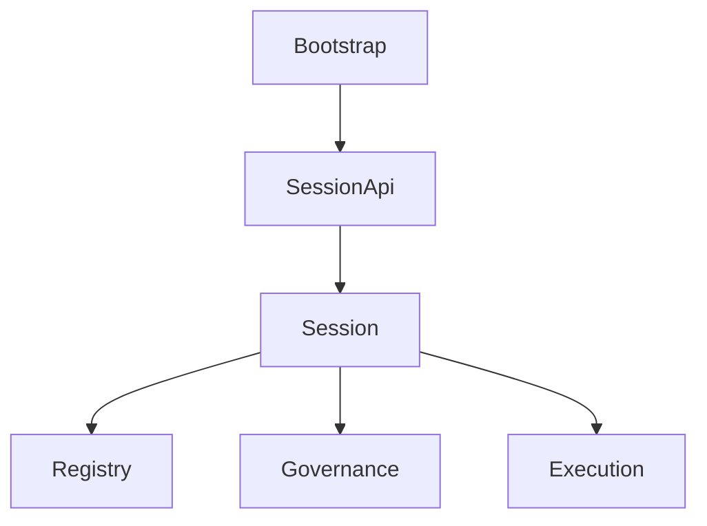

# 11: Runtime Coordination Layer

- Architecture Level: `L1`
- 状态: 草稿
- 日期: 2026-04-11
- 定位: 回答 bootstrap、SessionApi、session 与 registry/governance/execution 之间的协调主链如何成立。
- 关联文档:
  - `docs/architecture/2-garage-runtime-reference-model.md`
  - `docs/architecture/101-bootstrap-and-profiles.md`
  - `docs/architecture/102-session-and-session-api.md`
  - `docs/architecture/103-registry-and-discovery.md`

## 1. owner question

所有入口进入同一个 runtime 之后，谁负责把请求变成稳定的团队工作主线。

## 2. 协调主链

## 3. 关键判断

- bootstrap 只负责启动与绑定，不解释业务能力
- `SessionApi` 是 entry-facing choke point
- `Session` 是团队工作主线边界
- registry / governance / execution 围绕 session 协作

## 4. 非目标

- 不让入口直接操作 execution internals
- 不让 session 退化成临时聊天上下文桶
