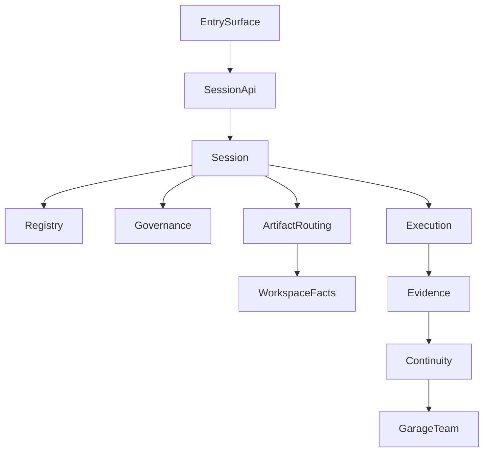

# 2: Garage Runtime Reference Model

- Architecture Level: `L0`
- 状态: 草稿
- 日期: 2026-04-11
- 定位: 这份文档回答一个问题：支撑 `Garage Team` 工作环境的稳定 runtime 参考模型是什么。
- 关联文档:
  - `docs/GARAGE.md`
  - `docs/architecture/1-garage-system-overview.md`
  - `docs/architecture/11-runtime-coordination-layer.md`
  - `docs/architecture/21-evidence-and-continuity-layer.md`

## 1. 这份文档回答什么

如果 `Garage` 的产品对象是 `Garage Team`，那么 runtime 至少要稳定下面这些对象：

- team
- entry surface
- session
- workspace
- governance
- execution
- evidence
- continuity
- pack extension

## 2. 参考模型

## 3. 稳定对象

- `Garage Team`：用户拥有并培养的团队对象
- `SessionApi`：所有入口进入 runtime 的统一请求面
- `Session`：当前团队工作主线
- `Registry`：能力发现与 pack 绑定
- `Governance`：review、approval、archive、growth gate
- `Execution`：provider / tool invocation
- `ArtifactRouting`：工作结果进入 workspace facts 的路径
- `Evidence`：追溯与 growth 观察面
- `Continuity`：`memory / skill / proposal / update` 的长期分层

## 4. 不可退让的运行时约束

- one runtime, many entry surfaces
- workspace-first facts
- packs declare capabilities, not vendors
- growth remains evidence-first and governance-bounded

## 5. 与下游分层文档的关系

- `10-41`：把上面的对象拆成分层架构
- `101+`：把关键对象继续拆成子系统
