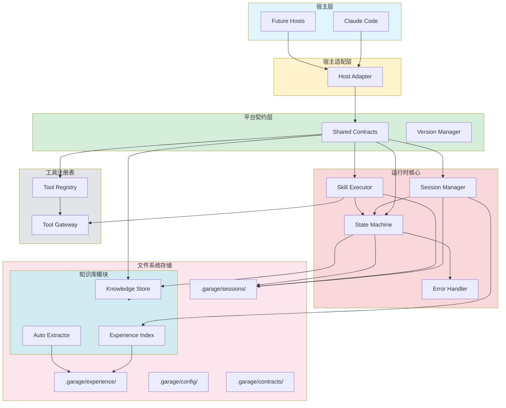
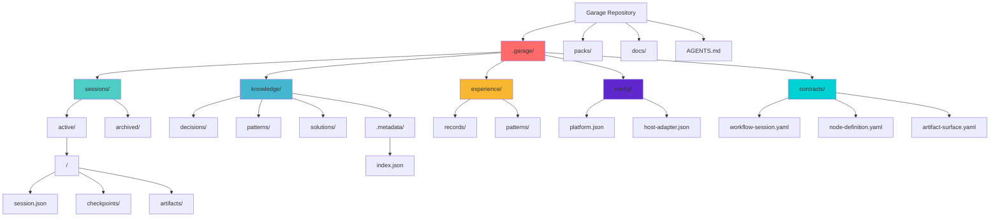
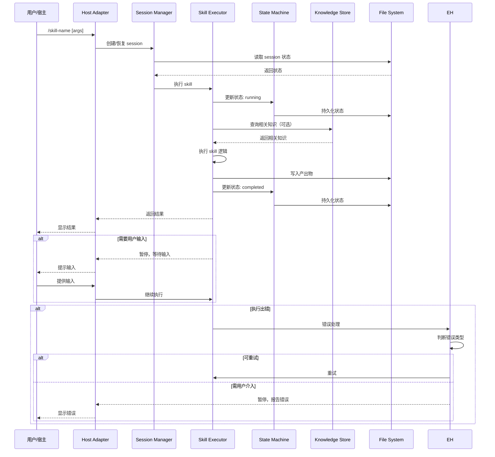
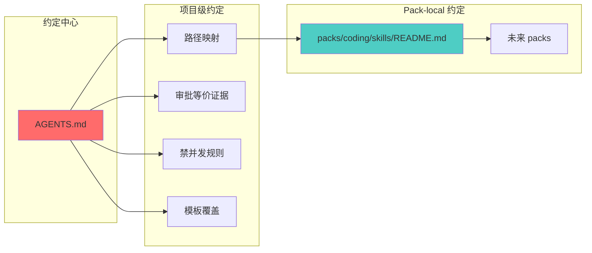
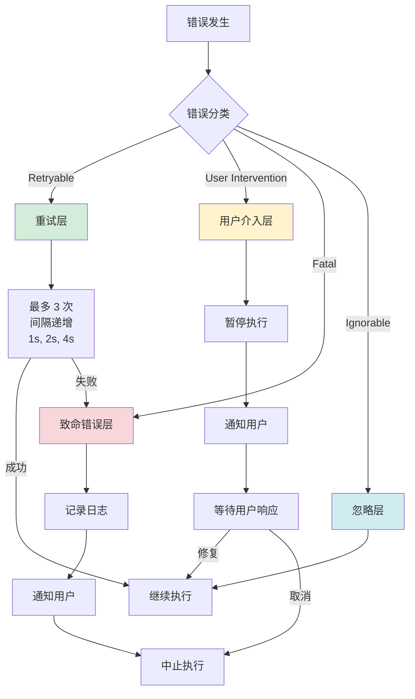

# Garage Agent 操作系统实现设计

- 状态: 草稿
- 主题: Garage Agent 操作系统
- 日期: 2026-04-15
- 关联规格: docs/features/F001-garage-agent-operating-system.md

---

## 1. 概述

本设计文档说明如何将 Garage 从静态 markdown skills 工作区演进为 Agent 操作系统，覆盖 Phase 1 实现（对应成长策略的 Stage 1-2）。

### 1.1 设计目标

从「工具箱」（Stage 1）演进到「记忆体」（Stage 2）：
- **Stage 1（工具箱）**：建立运行时基础，以 Claude Code 为第一个宿主，但设计宿主适配层
- **Stage 2（记忆体）**：实现自动知识积累、经验检索、会话状态持续化

### 1.2 核心设计约束

1. **不引入数据库、常驻服务、Web UI**
2. **优先使用 markdown、JSON、文件系统**
3. **所有数据存储在 Garage 仓库内部**
4. **保持现有 26 个 AHE skills 的兼容**
5. **为 Stage 2-4 预留扩展点但不提前实现**

### 1.3 设计原则检验

本设计严格遵循 `docs/soul/design-principles.md` 的五条原则：

| 原则 | 检验标准 | 设计体现 |
|------|---------|---------|
| **宿主无关** | 移除 Claude Code 后核心约定是否仍完整 | 宿主适配层隔离；平台术语中立；不依赖宿主特定 API |
| **文件即契约** | Agent 读文件能否正确理解系统状态 | 所有数据文件包含 front matter；目录结构自解释 |
| **渐进复杂度** | 第一天零配置能否工作 | Stage 1 最小形态；每个升级阶段有明确触发条件 |
| **自描述** | 去掉外部文档后 Agent 能否独立使用 | 每个文件/目录包含足够元信息；schema 显式声明 |
| **约定可发现** | 新 Agent 能否 5 分钟内找到所有约定 | AGENTS.md 为约定中心；分层可发现 |

---

## 2. 设计驱动因素

### 2.1 从规格提取的核心需求

| 需求编号 | 核心要求 | 设计影响 |
|---------|---------|---------|
| **FR-001a** | 工作流技能执行 | 需要运行时调度器、skill registry、执行状态机 |
| **FR-001b** | 执行状态管理 | 需要 session 持久化、检查点机制、恢复协议 |
| **FR-001c** | 错误处理与恢复 | 需要错误分类、重试策略、用户介入协议 |
| **FR-002** | 知识存储与检索 | 需要知识库 schema、自动提取机制、检索接口 |
| **FR-003** | Claude Code 对接 | 需要宿主适配器、标准调用接口 |
| **FR-004** | 数据仓库内部存储 | 需要目录结构设计、文件格式约定 |
| **FR-005** | 可迁移性 | 所有数据在仓库内；路径可移植；不依赖绝对路径 |
| **FR-006a/b** | 模式识别与经验积累 | 需要经验记录 schema、模式识别算法（Stage 2） |
| **FR-007** | 工具扩展接口 | 需要工具注册机制、统一调用接口 |
| **FR-008** | 渐进式架构演进 | 需要版本管理、向后兼容策略、升级路径 |

### 2.2 非功能需求

| NFR 类别 | 具体要求 | 设计影响 |
|---------|---------|---------|
| **性能** | 90% skill 调用 30s 内响应；90% 查询 5s 内返回 | 文件索引优化；惰性加载；缓存策略（Stage 2） |
| **可靠性** | 数据完整性；简单并发控制 | 文件锁；原子写入；git 版本控制 |
| **安全性** | 敏感数据保护；隐私 | 不明文存储凭证；.gitignore 规则；访问控制提示 |
| **可维护性** | 模块边界清晰；低耦合 | 分层架构；标准接口；插件式扩展 |
| **兼容性** | 跨平台；向后兼容 | 路径抽象；schema 版本管理 |

### 2.3 外部接口与依赖

| 接口 | 类型 | 设计影响 |
|------|------|---------|
| **Claude Code API** | Must | 需要宿主适配器；预留其他宿主扩展点 |
| **文件系统** | Must | 目录结构设计；文件格式约定；路径可移植性 |
| **Markdown/JSON** | Should | 数据序列化；schema 设计 |
| **Git** | Should | 版本控制集成；状态追踪 |

---

## 3. 需求覆盖与追溯

### 3.1 需求到模块的映射

```
FR-001a/b/c (工作流执行) ──┐
                           ├──> 运行时核心
FR-003 (Claude Code 对接) ──┘       ├── Session Manager
                           │        ├── Skill Executor
FR-002 (知识存储) ──────────┤        ├── State Machine
                           │
FR-004 (数据仓库) ──────────┤        知识库模块
FR-005 (可迁移性) ──────────┤        ├── Knowledge Store
                           │        ├── Experience Index
FR-006a/b (经验积累) ───────┘        ├── Auto Extractor

FR-007 (工具扩展) ───────────────> 工具注册表
                                    ├── Tool Registry
                                    └── Tool Gateway

FR-008 (渐进架构) ───────────────> 平台契约层
                                    ├── Contract Schema
                                    ├── Host Adapter Interface
                                    └── Version Manager
```

### 3.2 关键需求承接路径

#### FR-001a/b/c（工作流执行）→ 运行时核心

**承接逻辑**：
- Session Manager 创建和恢复会话（FR-001b）
- Skill Executor 调用 AHE workflow skills（FR-001a）
- State Machine 跟踪执行状态和错误处理（FR-001c）

**验证方法**：
- 单元测试：session 创建、恢复、状态转换
- 集成测试：完整 workflow 执行路径
- 错误注入测试：重试策略、用户介入协议

#### FR-002（知识存储）→ 知识库模块

**承接逻辑**：
- Knowledge Store 存储结构化知识（markdown + JSON）
- Experience Index 按场景索引和检索
- Auto Extractor 自动提取知识（Stage 2）

**验证方法**：
- 单元测试：知识 CRUD、索引更新
- 性能测试：查询响应时间 < 5s（90th percentile）
- 兼容性测试：历史数据可读性

#### FR-004/FR-005（数据仓库 + 可迁移性）→ 目录结构设计

**承接逻辑**：
- `.garage/` 目录集中存储所有运行时数据
- 相对路径设计；不依赖绝对路径
- 文件格式自描述；包含完整元信息

**验证方法**：
- 迁移测试：仓库克隆到新环境可用
- 兼容性测试：跨平台路径处理
- 自描述测试：新 Agent 能独立理解文件

---

## 4. 架构模式选择

### 4.1 当前架构模式判断

基于 `packs/coding/skills/ahe-design/references/architecture-patterns.md` 的维度：

| 维度 | 判断 | 理由 |
|------|------|------|
| **部署模式** | 本地文件系统优先 | 不引入常驻服务；所有数据在仓库内 |
| **状态管理** | 文件-backed 状态 | Session、知识、配置都是文件 |
| **扩展方式** | Pack + Adapter | Skills 组织为 packs；宿主差异通过 adapter 消化 |
| **执行模式** | Event-driven + State Machine | Skill 触发是事件；执行由状态机管理 |
| **数据模式** | Document-first | Markdown 是主要格式；JSON 用于结构化数据 |
| **成长模式** | Layered Evolution | Stage 1-4 是演进层级，不是替代关系 |

### 4.2 选择的核心架构模式

**模式名称：Layered File-First Runtime with Host Adapter**

```
┌─────────────────────────────────────────────────────────────┐
│                    宿主层 (Host Layer)                       │
│  (Claude Code / Future: Cursor / Hermes / CLI)              │
└───────────────────────────┬─────────────────────────────────┘
                            │
┌───────────────────────────▼─────────────────────────────────┐
│                 宿主适配层 (Host Adapter Layer)              │
│  - 标准化调用接口                                            │
│  - 屏蔽宿主差异                                              │
│  - 协议转换                                                  │
└───────────────────────────┬─────────────────────────────────┘
                            │
┌───────────────────────────▼─────────────────────────────────┐
│                 平台契约层 (Platform Contract Layer)         │
│  - 中立术语定义                                              │
│  - Shared Contract Schema                                   │
│  - 版本管理                                                  │
└───────────────────────────┬─────────────────────────────────┘
                            │
              ┌─────────────┼─────────────┐
              │             │             │
┌─────────────▼─────┐ ┌────▼─────────┐ ┌▼──────────────────┐
│   运行时核心       │ │  知识库模块   │ │  工具注册表       │
│   (Runtime Core)  │ │  (Knowledge)  │ │  (Tool Registry)  │
│                   │ │              │ │                   │
│ - Session Manager │ │ - Knowledge  │ │ - Tool Registry   │
│ - Skill Executor  │ │ - Experience │ │ - Tool Gateway    │
│ - State Machine   │ │ - Auto       │ │ - Tool Adapter    │
│ - Error Handler   │ │   Extractor  │ │                   │
└───────────────────┘ └──────────────┘ └───────────────────┘
                            │
┌───────────────────────────▼─────────────────────────────────┐
│              文件系统存储层 (File System Storage)            │
│  .garage/                                                  │
│  ├── sessions/      # Session 状态和检查点                   │
│  ├── knowledge/     # 知识库（markdown + JSON 元数据）       │
│  ├── experience/    # 经验记录和索引                         │
│  ├── config/        # 配置文件                              │
│  └── contracts/     # 平台契约定义                           │
└─────────────────────────────────────────────────────────────┘
```

### 4.3 选择理由

1. **Layered**：清晰的职责分离；每层可独立测试和演进
2. **File-First**：符合 docs-first、workspace-first 的设计哲学
3. **Host Adapter**：实现宿主无关原则；便于迁移和扩展
4. **Platform Contract**：避免 AHE 私有术语泄漏到平台层
5. **State Machine**：复杂 workflow 执行的状态管理必要模式

### 4.4 不选择的模式及理由

| 模式 | 不选择理由 |
|------|-----------|
| **Microservices** | Solo creator 场景不需要分布式复杂度；违反"不引入常驻服务"约束 |
| **Event Sourcing** | 过度设计；文件系统 + git 已提供足够的版本追溯 |
| **CQRS** | 读写分离对文件系统存储收益不大；增加复杂度 |
| **Monolith** | 违反宿主无关原则；难以支持多宿主演进 |
| **Client-Server** | 不引入常驻服务；不需要网络通信 |

---

## 5. 候选方案

### 方案 A：平面文件系统（Flat File System）

**描述**：
```
.garage/
├── session-001.json
├── session-002.json
├── knowledge-001.md
├── knowledge-002.md
├── experience-001.json
└── config.json
```

所有文件平铺在 `.garage/` 目录，通过文件名前缀区分类型。

**优点**：
- 实现最简单
- 第一天零配置
- 没有目录结构维护成本

**缺点**：
- 扩展性差（文件数量 >100 时难以管理）
- 缺乏分类和组织
- 难以实现批量操作
- 违反"约定可发现"原则（Agent 无法快速理解文件用途）

**对约束的影响**：
- ✅ 符合"不引入数据库"
- ✅ 符合"优先使用 markdown、JSON、文件系统"
- ❌ 不符合"为 Stage 2-4 预留扩展点"
- ❌ 不符合"约定可发现"原则

### 方案 B：结构化目录 + 自描述元数据（Structured Directory with Self-Describing Metadata）

**描述**：
```
.garage/
├── sessions/
│   ├── active/
│   │   └── <session-id>/
│   │       ├── session.json           # Session 元数据
│   │       ├── checkpoints/           # 执行检查点
│   │       └── artifacts/             # 产出物引用
│   └── archived/
│       └── <session-id>/
│           └── archive.json           # 归档快照
├── knowledge/
│   ├── decisions/
│   │   └── decision-001.md            # 包含 front matter
│   ├── patterns/
│   │   └── pattern-001.md
│   └── solutions/
│       └── solution-001.md
│   └── .metadata/
│       └── index.json                 # 检索索引（Stage 2）
├── experience/
│   ├── records/
│   │   └── <task-id>.json
│   └── patterns/
│       └── pattern-001.json
├── config/
│   ├── platform.json                 # 平台配置
│   └── host-adapter.json             # 宿主适配器配置
└── contracts/
    ├── workflow-session.yaml
    ├── node-definition.yaml
    └── artifact-surface.yaml
```

每个文件包含 front matter 或 JSON 元数据，说明其用途和结构。

**优点**：
- 清晰的分类和组织
- 易于扩展（每个子目录可以独立演进）
- 符合"约定可发现"原则（目录名称自解释）
- 支持批量操作和目录级管理
- 为 Stage 2-4 预留了清晰的扩展点

**缺点**：
- 实现比方案 A 略复杂（需要目录管理逻辑）
- 需要明确的目录约定和文档

**对约束的影响**：
- ✅ 符合"不引入数据库"
- ✅ 符合"优先使用 markdown、JSON、文件系统"
- ✅ 符合"为 Stage 2-4 预留扩展点"
- ✅ 符合"约定可发现"原则
- ✅ 符合"文件即契约"原则

### 方案 C：混合结构（目录 + 混合格式）

**描述**：
- 知识用 markdown（人类可读优先）
- Session 和经验用 SQLite（性能优先）
- 配置用 YAML

**优点**：
- 针对不同场景优化

**缺点**：
- ❌ 违反 CON-001 技术栈约束（Phase 1 不引入数据库）
- ❌ 增加复杂度（需要处理多种格式）
- ❌ 违反"渐进复杂度"原则（第一天需要数据库配置）

---

## 6. 选定方案与关键决策

### 6.1 选定方案

**选择：方案 B - 结构化目录 + 自描述元数据**

**理由**：
1. 符合所有设计原则（5/5 通过）
2. 满足所有关键约束
3. 为 Stage 2-4 预留清晰扩展点
4. 长期可维护性和可扩展性最好

### 6.2 关键决策（ADR）

#### ADR-001: 采用文件系统作为主存储引擎

**状态**：已接受

**背景**：
- 规格要求"所有数据存储在 Garage 仓库内部"
- 约束明确"Phase 1 不引入数据库"
- Solo creator 场景下并发概率低
- 知识库规模在 Stage 1-2 预计 <1000 条

**决策**：
采用文件系统（markdown + JSON）作为 Phase 1 主存储引擎，不引入数据库。

**被考虑的备选方案**：
- **SQLite**：否决原因 - 违反 CON-001；第一天需要数据库配置
- **纯内存**：否决原因 - 无法持久化；违反 FR-004 可迁移性
- **Remote Storage**：否决原因 - 违反"所有数据在仓库内部"

**后果**：
- **正面**：
  - 零配置启动
  - 数据可读性强（人类可直接查看）
  - Git 原生集成（版本控制、协作）
  - 迁移成本极低（直接复制目录）
- **负面**：
  - 查询性能不如数据库（但 Stage 1-2 规模下可接受）
  - 并发控制较弱（但 solo creator 场景下问题不大）
  - 需要手动实现索引和缓存（Stage 2+）
- **中性**：
  - 文件数量增长后需要目录结构优化

**可逆性评估**：中等成本重构
- 如果未来需要迁移到数据库，可以编写迁移脚本
- 文件 schema 已明确，迁移路径清晰
- 但应该尽量推迟这个决策，直到明确的性能瓶颈

---

#### ADR-002: 定义平台中立术语，避免 AHE 私有语言泄漏

**状态**：已接受

**背景**：
- W140 分析指出 AHE 术语与平台术语混淆的问题
- 规格要求"平台优先，从单 pack 启动"
- 设计原则要求"宿主无关"
- 未来需要支持第二个、第三个 non-coding pack

**决策**：
平台层只使用中立术语（session、node、artifact、evidence、approval），AHE 特定术语（spec、design、tasks）保留为 pack-local 命名。

**被考虑的备选方案**：
- **AHE 术语即平台术语**：否决原因 - 第二个 pack 会被迫继承 AHE 语义；违反平台优先原则
- **完全通用抽象**：否决原因 - 过度抽象；第一阶段不切实际

**后果**：
- **正面**：
  - 平台与 pack 边界清晰
  - 未来 pack 不受 AHE 约束
  - 长期架构更健康
- **负面**：
  - 兼容期内需要维护映射关系
  - 文档和代码中存在两套术语
- **中性**：
  - AHE pack 可以有自己的命名习惯

**可逆性评估**：高成本重构
- 一旦第二个 pack 基于 AHE 术语实现，重构成本极高
- 现在确定边界比未来重新划分成本低得多

---

#### ADR-003: 采用 Artifact-First + Board-Assisted 模式

**状态**：已接受

**背景**：
- W140 指出"board-first"是长期目标，但第一阶段不成熟
- 设计原则要求"文件即契约"
- 当前仓库的工件（spec、design、tasks）已经存在且有明确格式
- 过渡到 board-first 需要完整的 machine-readable contract

**决策**：
Phase 1 采用"artifact-first + board-assisted"模式：
- 工件（markdown 文件）是权威真相源
- Workflow board 辅助协调和恢复
- 若 board 与工件冲突，以工件为准

**被考虑的备选方案**：
- **完全 Board-First**：否决原因 - contracts/ 和 schemas/ 目前为空；machine-readable contract 尚未定义；第一阶段不切实际
- **完全 Artifact-First（无 board）**：否决原因 - 缺少运行时协调能力；难以实现 session 恢复和状态跟踪

**后果**：
- **正面**：
  - 第一阶段可落地
  - 保持现有 skills 兼容
  - 符合 docs-first 哲学
  - 渐进式演进路径清晰
- **负面**：
  - 存在 dual-read / dual-write（需要同步机制）
  - board 的能力受限
- **中性**：
  - 未来需要明确切到 board-first 的时机

**可逆性评估**：中等成本重构
- 当 contracts/ 和 schemas/ 完善后，可以逐步切到 board-first
- 需要明确的切换标准和验证流程

---

#### ADR-004: 分阶段实现经验积累机制

**状态**：已接受

**背景**：
- FR-006a/b 要求模式识别和经验积累
- 成长策略定义了 Stage 1-4 的演进路径
- Stage 1 是"工具箱"，Stage 2 才是"记忆体"
- 过早实现复杂机制会增加不必要的复杂度

**决策**：
经验积累机制分两个阶段实现：
- **Phase 1（Stage 1）**：手动记录；提供基本数据结构
- **Phase 2（Stage 2）**：自动提取；模式识别；智能推荐

**被考虑的备选方案**：
- **第一天就完整实现**：否决原因 - 违反渐进复杂度原则；过度工程；没有真实数据支撑算法设计
- **不做经验积累**：否决原因 - 违反核心愿景"自我成长"

**后果**：
- **正面**：
  - 第一天可用
  - 复杂度可控
  - 可以先收集真实数据再设计算法
- **负面**：
  - Stage 1 用户体验较弱（手动维护）
- **中性**：
  - 需要明确 Stage 1→2 的触发信号

**可逆性评估**：容易回滚
- 数据结构已定义；后续增强是 additive 的
- 不会破坏已有数据

---

#### ADR-005: 所有敏感数据排除在仓库之外

**状态**：已接受

**背景**：
- NFR-004 要求安全性和隐私保护
- FR-004 要求数据仓库内部存储，但敏感数据需要例外
- 仓库可能被公开分享

**决策**：
所有敏感数据（API keys、凭证、个人身份信息）不写入仓库，通过环境变量或系统密钥管理提供。

**被考虑的备选方案**：
- **明文存储在仓库**：否决原因 - 安全风险；无法公开分享
- **加密存储在仓库**：否决原因 - 增加复杂度；钥匙管理问题
- **系统密钥管理（keychain、vault）**：可选 - Phase 2+ 考虑

**后果**：
- **正面**：
  - 仓库可安全分享
  - 符合安全最佳实践
- **负面**：
  - 需要额外的配置步骤
  - 迁移时需要重新配置
- **中性**：
  - 需要在文档中明确说明配置方法

**可逆性评估**：容易回滚
- 敏感数据本来就不应该在仓库里
- 这是一个可以随时强化的策略

---

## 7. 架构图

### 7.1 顶层架构图



### 7.2 目录结构图



### 7.3 数据流图 - Skill 执行流程



### 7.4 约定图（Convention Map）



---

## 8. 模块职责与边界

### 8.1 宿主适配层（Host Adapter Layer）

**职责**：
- 接收来自宿主的调用请求
- 标准化调用接口和参数
- 屏蔽宿主差异（Claude Code vs Cursor vs Hermes）
- 协议转换（宿主特定格式 → 平台中立格式）

**不负责**：
- 执行 skill 逻辑
- 管理会话状态
- 存储数据

**接口**：
```yaml
# contracts/host-adapter-interface.yaml
HostAdapter:
  invoke_skill:
    input:
      skill_id: string
      parameters: object
      session_context: object
    output:
      result: object
      error: Error | null

  read_file:
    input:
      path: string
    output:
      content: string
      error: Error | null

  write_file:
    input:
      path: string
      content: string
    output:
      success: boolean
      error: Error | null
```

### 8.2 平台契约层（Platform Contract Layer）

**职责**：
- 定义平台中立术语和对象
- 管理 shared contract schema
- 版本管理和兼容性检查
- Pack registry（注册和发现 packs）

**不负责**：
- 执行逻辑
- 直接操作文件系统
- 宿主特定行为

**关键对象**：
- `PackDefinition`: Pack 的元数据和能力声明
- `WorkflowSession`: 会话的抽象定义
- `NodeDefinition`: 节点的契约定义
- `ArtifactSurface`: 工件的权威路径映射

### 8.3 运行时核心（Runtime Core）

#### Session Manager

**职责**：
- 创建和恢复会话
- 管理会话生命周期
- 持久化会话状态
- 处理并发和锁

**不负责**：
- 执行 skill 逻辑
- 知识管理
- 工具调用

**接口**：
```yaml
# contracts/session-manager.yaml
SessionManager:
  create_session:
    input:
      pack_id: string
      topic: string
      initial_context: object
    output:
      session_id: string
      session_state: SessionState

  restore_session:
    input:
      session_id: string
    output:
      session_state: SessionState | null

  update_session:
    input:
      session_id: string
      updates: object
    output:
      success: boolean

  archive_session:
    input:
      session_id: string
    output:
      archive_id: string
```

#### Skill Executor

**职责**：
- 调用 AHE workflow skills
- 管理 skill 执行上下文
- 处理 skill 输入输出
- 集成知识库查询（可选）

**不负责**：
- 状态管理（由 Session Manager 负责）
- 错误恢复策略（由 Error Handler 负责）

**接口**：
```yaml
# contracts/skill-executor.yaml
SkillExecutor:
  execute_skill:
    input:
      skill_id: string
      parameters: object
      session_context: SessionContext
    output:
      result: SkillResult
      state_update: StateUpdate

  get_skill_metadata:
    input:
      skill_id: string
    output:
      metadata: SkillMetadata | null
```

#### State Machine

**职责**：
- 管理执行状态转换
- 实现状态转换规则
- 触发状态相关的副作用
- 维护状态历史

**不负责**：
- 执行业务逻辑
- 错误处理（只负责转换到 error 状态）

**状态定义**：
```yaml
# contracts/state-machine.yaml
states:
  idle: 初始状态
  running: 执行中
  paused: 等待用户输入
  completed: 执行完成
  failed: 执行失败
  archived: 已归档

transitions:
  idle -> running: 开始执行
  running -> paused: 需要用户输入
  paused -> running: 用户响应
  running -> completed: 执行成功
  running -> failed: 执行失败
  failed -> running: 重试
  any -> archived: 归档
```

#### Error Handler

**职责**：
- 分类错误类型
- 执行错误处理策略
- 重试逻辑
- 用户介入协议

**不负责**：
- 状态转换（通知 State Machine）
- 业务逻辑恢复

**错误分类**：
```yaml
# contracts/error-handler.yaml
error_types:
  retryable:
    - network_timeout
    - temporary_file_lock
    - rate_limit_exceeded
  user_intervention:
    - permission_denied
    - missing_data
    - configuration_error
    - validation_error
  ignorable:
    - duplicate_notification
    - already_in_target_state
    - informational_warning
  fatal:
    - corrupt_data
    - incompatible_version
    - resource_exhausted

strategies:
  retryable:
    max_attempts: 3
    backoff: [1s, 2s, 4s]
  user_intervention:
    pause: true
    notify_user: true
  ignorable:
    log: true
    continue: true
  fatal:
    pause: true
    log_error: true
```

### 8.4 知识库模块（Knowledge Module）

#### Knowledge Store

**职责**：
- 存储和检索知识条目
- 维护知识索引
- 管理知识分类
- 版本追踪

**不负责**：
- 自动提取知识（由 Auto Extractor 负责）
- 模式识别（由 Experience Index 负责）

**数据结构**：
```yaml
# .garage/knowledge/decisions/decision-001.md
---
type: decision
id: decision-001
topic: "选择 markdown 作为知识存储格式"
date: 2026-04-15
tags: [architecture, storage, markdown]
related_decisions: []
related_tasks: []
source_session: session-123
source_artifact: docs/designs/2026-04-15-garage-agent-os-design.md
version: 1
status: active
---

## 决策内容

采用 markdown 作为知识存储的主要格式。

### 理由
...

### 替代方案
...

### 影响
...
```

#### Experience Index

**职责**：
- 索引执行经验
- 按场景检索经验
- 推荐相关经验
- 管理模式标签

**不负责**：
- 自动提取经验（手动记录，Phase 1）
- 模式识别算法（Phase 2）

**数据结构**：
```json
// .garage/experience/records/task-001.json
{
  "record_id": "task-001",
  "task_type": "feature_implementation",
  "skill_ids": ["ahe-specify", "ahe-design", "ahe-tasks"],
  "tech_stack": ["TypeScript", "React", "Node.js"],
  "domain": "web_development",
  "outcome": "success",
  "duration_seconds": 3600,
  "session_id": "session-123",
  "artifacts": [
    "docs/features/F001-garage-agent-operating-system.md",
    "docs/designs/2026-04-15-garage-agent-os-design.md"
  ],
  "key_patterns": [
    "incremental_validation",
    "early_feedback"
  ],
  "lessons_learned": [
    "Front matter validation catches errors early",
    "Stakeholder review prevents rework"
  ],
  "created_at": "2026-04-15T10:00:00Z"
}
```

#### Auto Extractor

**职责**：
- 从会话中自动提取知识
- 识别可复用的模式
- 生成经验记录草稿
- 用户确认机制

**不负责**：
- 最终决策（由用户确认）
- 复杂的模式识别算法（Phase 2）

**触发条件**（Stage 2）：
- 会话完成时自动触发
- 用户主动调用
- 定期批处理（夜间）

### 8.5 工具注册表（Tool Registry）

**职责**：
- 注册和管理工具
- 提供工具发现接口
- 统一工具调用接口
- 工具适配器管理

**不负责**：
- 工具的具体实现
- 工具的执行逻辑

**数据结构**：
```yaml
# .garage/config/tools/registered-tools.yaml
tools:
  - tool_id: "github-api"
    name: "GitHub API"
    version: "1.0.0"
    adapter: "github-api-adapter"
    capabilities:
      - read_repository
      - create_issue
      - create_pull_request
    config_schema:
      type: object
      properties:
        api_token:
          type: string
         敏感: true
        repository:
          type: string
    required_permissions:
      - repo_read
      - repo_write
```

**工具调用时序**：

```
1. Skill Executor 识别需要工具支持（skill 声明 tool_dependency）
   ↓
2. Tool Gateway 查询 Tool Registry，验证工具已注册且可用
   ↓
3. Tool Gateway 检查权限（required_permissions vs session 权限）
   ↓
4. 权限通过 → 加载对应 adapter，传入 config（从 platform.json 或环境变量读取）
   ↓
5. Adapter 执行工具调用，返回标准化结果
   ↓
6. Tool Gateway 记录调用日志（tool_id、耗时、结果状态）
   ↓
7. Skill Executor 接收结果，继续 skill 流程
```

> **Phase 1 简化**：工具注册表为声明式配置，Tool Gateway 仅做权限检查和日志记录。实际的工具调用由 Skill Executor 直接通过 Host Adapter 执行。复杂的工具编排（链式调用、并行调用）延后到 Stage 2+。

---

## 9. 数据流、控制流与关键交互

### 9.1 Skill 执行完整流程

```
1. 用户调用 /skill-name [args]
   ↓
2. Host Adapter 接收调用，标准化参数
   ↓
3. Session Manager:
   a. 检查是否有活跃 session
   b. 如果没有，创建新 session
   c. 如果有，恢复 session 状态
   ↓
4. State Machine 更新状态: idle → running
   ↓
5. Skill Executor:
   a. 读取 skill metadata（从 contracts/）
   b. 准备执行上下文
   c. 可选：查询知识库获取相关知识
   ↓
6. 执行 skill 逻辑:
   a. 读取必要的输入文件
   b. 执行 skill 定义的步骤
   c. 产出 artefacts 到约定路径
   ↓
7. 知识库更新（可选）:
   a. Auto Extractor 识别可提取的知识
   b. 生成知识草稿
   c. 用户确认后存储
   ↓
8. State Machine 更新状态: running → completed
   ↓
9. Session Manager 持久化最终状态
   ↓
10. Host Adapter 返回结果给用户
```

### 9.2 错误处理流程

```
1. Skill 执行过程中抛出错误
   ↓
2. Error Handler 捕获错误
   ↓
3. 错误分类:
   a. Retryable（网络超时、临时锁）
   b. User Intervention（权限、配置）
   c. Fatal（数据损坏、版本不兼容）
   ↓
4a. Retryable:
   a. 重试（最多 3 次，间隔递增）
   b. 如果成功，继续执行
   c. 如果失败，转为 Fatal
   ↓
4b. User Intervention:
   a. State Machine 更新状态: running → paused
   b. 生成错误报告
   c. Host Adapter 通知用户
   d. 等待用户响应
   e. 用户修复后，从暂停点恢复
   ↓
4c. Fatal:
   a. State Machine 更新状态: running → failed
   b. 记录错误日志
   c. 通知用户
   d. 停止执行
```

### 9.3 Session 恢复流程

```
1. 用户调用 /resume <session-id>
   ↓
2. Session Manager:
   a. 读取 .garage/sessions/active/<session-id>/session.json
   b. 验证 session 完整性（checksum 校验）
   c. 如果损坏，尝试从 checkpoints 恢复
   ↓
3. State Machine:
   a. 恢复到上次状态
   b. 识别下一个推荐节点
   ↓
4. Host Adapter 显示当前状态和推荐操作
   ↓
5. 用户选择继续或重新开始
   ↓
6. 如果继续，从上次中断点继续执行
```

#### Checkpoint 损坏降级策略

当 session.json 或 checkpoint 数据损坏时，按以下优先级降级：

```
恢复优先级链：
  1. session.json 有效 → 直接恢复
  2. session.json 损坏，最新 checkpoint 有效 → 从 checkpoint 恢复
  3. 最新 checkpoint 损坏，回退到上一个有效 checkpoint
  4. 所有 checkpoint 都损坏 → 降级到 "artifact-first 重建"
  5. 无任何可恢复数据 → 提示用户 "从头开始"

Artifact-First 重建（第 4 级降级）：
  - 扫描 artifacts/ 目录下所有已存在的工件
  - 从工件 front matter 提取状态信息
  - 重建最小可行的 session 状态
  - 标记 session 为 "recovered" 状态
  - 日志记录完整降级路径
```

### 9.4 Artifact-Board 一致性协议

ADR-003 声明"若 board 与工件冲突，以工件为准"。本节定义具体的冲突检测、处理和日志记录规则。

#### 检测时机

| 触发点 | 检查内容 |
|--------|---------|
| Session 恢复时 | 比较 board 中记录的 artifact status 与磁盘文件实际状态 |
| Skill 执行前 | 验证 board 中记录的 input artifact 是否存在且内容匹配 |
| Skill 执行后 | 验证 output artifact 是否已正确写入磁盘 |

#### 比较方法

```
1. 提取 board 中记录的 artifact 字段：path、status、updated_at
2. 检查磁盘文件是否存在
3. 如果文件存在，计算 front matter 的关键字段 hash（id、status、date）
4. 比较结果分类：
   - 一致 → 无需处理
   - 文件已更新（hash 不同）→ 以文件为准，同步更新 board
   - 文件已删除但 board 仍引用 → 标记为 orphan，记录日志
   - 文件存在但 board 未引用 → 标记为 untracked，记录日志
```

#### 冲突解决规则

1. **文件内容 > board 记录**：始终以磁盘文件的实际内容为准
2. **自动同步**：发现不一致时自动更新 board，不需要用户介入
3. **日志记录**：每次同步写入 `.garage/sessions/active/<session-id>/sync-log.json`

#### 日志格式

```json
// sync-log.json 条目示例
{
  "sync_id": "sync-20260415-001",
  "timestamp": "2026-04-15T12:00:00Z",
  "trigger": "session_resume",
  "artifact_path": "docs/designs/2026-04-15-garage-agent-os-design.md",
  "board_status": "draft",
  "file_status": "review",
  "action": "board_updated",
  "resolved_by": "artifact_first_rule"
}
```

### 9.5 知识提取和推荐流程（Stage 2）

```
1. Session 完成后
   ↓
2. Auto Extractor:
   a. 分析 session transcript
   b. 识别技术决策、架构选择、问题解决方案
   c. 提取关键模式和经验
   ↓
3. 生成知识草稿:
   a. Decision 草稿
   b. Pattern 草稿
   c. Experience Record 草稿
   ↓
4. 用户确认:
   a. 展示草稿给用户
   b. 用户编辑和确认
   c. 存储到知识库
   ↓
5. Experience Index:
   a. 更新索引
   b. 提取标签和分类
   ↓
6. 下次执行类似任务时:
   a. 查询 Experience Index
   b. 推荐相关经验
   c. 在 skill 执行过程中主动提示
```

---

## 10. 接口与契约

### 10.1 文件格式约定

#### Session 文件格式

```json
// .garage/sessions/active/<session-id>/session.json
{
  "schema_version": "1",
  "session_id": "session-20260415-001",
  "pack_id": "ahe-coding",
  "topic": "Garage Agent 操作系统设计",
  "graph_variant_id": "standard",
  "state": "running",
  "current_node_id": "ahe-design",
  "created_at": "2026-04-15T10:00:00Z",
  "updated_at": "2026-04-15T11:30:00Z",
  "context": {
    "spec_id": "F001",
    "design_id": "2026-04-15-garage-agent-os-design",
    "user_goals": ["运行时基础", "知识存储"],
    "constraints": ["不引入数据库", "文件系统优先"]
  },
  "artifacts": [
    {
      "artifact_role": "design",
      "path": "docs/designs/2026-04-15-garage-agent-os-design.md",
      "status": "draft",
      "created_at": "2026-04-15T11:00:00Z"
    }
  ],
  "checkpoints": [
    {
      "checkpoint_id": "cp-001",
      "node_id": "ahe-design",
      "timestamp": "2026-04-15T11:30:00Z",
      "state_snapshot": {...}
    }
  ],
  "metadata": {
    "host": "claude-code",
    "host_version": "1.0.0",
    "garage_version": "0.1.0"
  }
}
```

#### Knowledge 文件格式

```markdown
---
schema_version: "1"
type: decision
id: decision-001
topic: "采用文件系统作为主存储引擎"
date: 2026-04-15
tags: [architecture, storage, database]
category: technical
status: active
version: 1
supersedes: []
superseded_by: []
source_session: session-20260415-001
source_artifact: docs/designs/2026-04-15-garage-agent-os-design.md
related_decisions: []
related_tasks: []
---

## 决策内容

采用文件系统（markdown + JSON）作为 Phase 1 主存储引擎，不引入数据库。

## 理由

1. **零配置启动**：第一天无需配置数据库
2. **数据可读性强**：人类可直接查看和编辑
3. **Git 原生集成**：版本控制和协作
4. **迁移成本低**：直接复制目录即可

## 替代方案

- **SQLite**：否决原因 - 违反 CON-001；第一天需要数据库配置
- **纯内存**：否决原因 - 无法持久化；违反 FR-004 可迁移性

## 影响

### 正面

- 零配置启动
- 数据可读性强（人类可直接查看）
- Git 原生集成（版本控制、协作）
- 迁移成本极低（直接复制目录）

### 负面

- 查询性能不如数据库（但 Stage 1-2 规模下可接受）
- 并发控制较弱（但 solo creator 场景下问题不大）
- 需要手动实现索引和缓存（Stage 2+）

### 升级路径

当知识库规模 >1000 条目时，考虑引入 SQLite 或专门的全文检索引擎。
```

#### Experience Record 文件格式

```json
// .garage/experience/records/task-001.json
{
  "schema_version": "1",
  "record_id": "task-001",
  "task_type": "feature_implementation",
  "skill_ids": ["ahe-specify", "ahe-design"],
  "tech_stack": ["Markdown", "JSON", "File System"],
  "domain": "system_design",
  "problem_domain": "agent_operating_system",
  "outcome": "success",
  "duration_seconds": 3600,
  "complexity": "medium",
  "session_id": "session-20260415-001",
  "artifacts": [
    "docs/features/F001-garage-agent-operating-system.md",
    "docs/designs/2026-04-15-garage-agent-os-design.md"
  ],
  "key_patterns": [
    "layered_architecture",
    "file_first_storage",
    "host_adapter_pattern"
  ],
  "lessons_learned": [
    "结构化目录比平铺目录更易扩展",
    "平台中立术语避免 pack 耦合",
    "自描述元数据是 Agent-native 的基础"
  ],
  "pitfalls": [
    "过早优化会违反渐进复杂度原则",
    "AHE 私有术语泄漏到平台层"
  ],
  "recommendations": [
    "Phase 1 保持最简实现",
    "为 Stage 2-4 预留扩展点"
  ],
  "created_at": "2026-04-15T12:00:00Z",
  "updated_at": "2026-04-15T12:00:00Z"
}
```

#### Platform Config 文件格式

```json
// .garage/config/platform.json
{
  "schema_version": "1",
  "version": "0.1.0",
  "stage": "1",
  "storage": {
    "type": "filesystem",
    "root": ".garage",
    "encoding": "utf-8"
  },
  "execution": {
    "max_concurrent_sessions": 1,
    "session_timeout_seconds": 86400,
    "checkpoint_interval_seconds": 60
  },
  "knowledge": {
    "auto_extract": false,
    "extraction_trigger": "manual",
    "index_type": "file_system"
  },
  "governance": {
    "required_approvals": {
      "spec": ["specApproval"],
      "design": ["designApproval"]
    },
    "artifact_surfaces": {
      "spec": "docs/features/",
      "design": "docs/designs/",
      "tasks": "docs/tasks/"
    }
  },
  "supported_schema_versions": {
    "session": ["1"],
    "knowledge": ["1"],
    "experience": ["1"],
    "platform": ["1"]
  }
}
```

### 10.2 契约格式约定

> **Phase 1 约定**：当前接口契约使用人类可读的 YAML 伪语法，用于设计阶段的概念澄清和团队沟通。这些契约不可直接机器校验。
>
> **Phase 2 升级路径**：当进入实现阶段后，核心接口将迁移到 JSON Schema 格式，存放在 `.garage/contracts/` 目录，支持自动化校验。迁移时保留当前 YAML 作为人类可读的参考文档。
>
> **当前格式规则**：
> - `interface <Name>:` 声明接口名称
> - `method <verb>:` 定义方法，后跟参数和返回值
> - 参数使用 `name: type` 格式，类型为语义描述（非严格类型系统）
> - 契约文件命名：`contracts/<module>-interface.yaml`

### 10.3 接口契约

#### Host Adapter 接口

```yaml
# contracts/host-adapter-interface.yaml
interface HostAdapter:
  # 调用 skill
  method invoke_skill:
    input:
      skill_id: string
      parameters:
        type: object
        additionalProperties: true
      session_context:
        type: object
        properties:
          session_id?: string
          user_id?: string
          workspace_path: string
    output:
      result:
        type: object
        additionalProperties: true
      error:
        type: object
        nullable: true
        properties:
          code: string
          message: string
          details?: object

  # 读取文件
  method read_file:
    input:
      path: string
      encoding?: string  # default: utf-8
    output:
      content: string
      error:
        type: object
        nullable: true

  # 写入文件
  method write_file:
    input:
      path: string
      content: string
      encoding?: string  # default: utf-8
      create_directories?: boolean  # default: true
    output:
      success: boolean
      error:
        type: object
        nullable: true

  # 获取仓库状态
  method get_repository_state:
    input: {}
    output:
      branch: string
      commit_hash: string
      is_dirty: boolean
      error:
        type: object
        nullable: true
```

#### Session Manager 接口

```yaml
# contracts/session-manager-interface.yaml
interface SessionManager:
  # 创建 session
  method create_session:
    input:
      pack_id: string
      topic: string
      graph_variant_id?: string
      initial_context:
        type: object
        additionalProperties: true
    output:
      session_id: string
      session_state: SessionState
      error:
        type: object
        nullable: true

  # 恢复 session
  method restore_session:
    input:
      session_id: string
    output:
      session_state: SessionState | null
      error:
        type: object
        nullable: true

  # 更新 session
  method update_session:
    input:
      session_id: string
      updates:
        type: object
        properties:
          state?: string
          current_node_id?: string
          context?: object
          artifacts?: array
    output:
      success: boolean
      error:
        type: object
        nullable: true

  # 归档 session
  method archive_session:
    input:
      session_id: string
    output:
      archive_id: string
      error:
        type: object
        nullable: true

  # 列出活跃 sessions
  method list_active_sessions:
    input:
      limit?: integer  # default: 10
    output:
      sessions: array<SessionSummary>
      error:
        type: object
        nullable: true

types:
  SessionState:
    properties:
      session_id: string
      pack_id: string
      topic: string
      state: string  # idle | running | paused | completed | failed
      current_node_id?: string
      created_at: string  # ISO 8601
      updated_at: string  # ISO 8601
      context: object
      artifacts: array<ArtifactReference>

  SessionSummary:
    properties:
      session_id: string
      topic: string
      state: string
      created_at: string
      updated_at: string

  ArtifactReference:
    properties:
      artifact_role: string  # spec | design | tasks | code
      path: string
      status: string  # draft | review | approved
      created_at: string
```

#### Skill Executor 接口

```yaml
# contracts/skill-executor-interface.yaml
interface SkillExecutor:
  # 执行 skill
  method execute_skill:
    input:
      skill_id: string
      parameters:
        type: object
        additionalProperties: true
      session_context: SessionContext
    output:
      result: SkillResult
      state_update: StateUpdate
      error:
        type: object
        nullable: true

  # 获取 skill metadata
  method get_skill_metadata:
    input:
      skill_id: string
    output:
      metadata: SkillMetadata | null
      error:
        type: object
        nullable: true

  # 列出可用 skills
  method list_skills:
    input:
      pack_id?: string
    output:
      skills: array<SkillMetadata>
      error:
        type: object
        nullable: true

types:
  SkillResult:
    properties:
      success: boolean
      outputs:
        type: object
        additionalProperties: true
      artifacts: array<ArtifactReference>
      messages: array<string>

  StateUpdate:
    properties:
      next_state: string
      next_node_id?: string
      context_updates?: object

  SkillMetadata:
    properties:
      skill_id: string
      name: string
      description: string
      pack_id: string
      version: string
      trigger_conditions: array<string>
      required_inputs: array<string>
      outputs: array<string>
      hard_gates: array<string>
```

### 10.4 平台契约 Schema

#### WorkflowSession Contract

```yaml
# contracts/workflow-session.yaml
type: object
properties:
  session_id:
    type: string
    pattern: "^session-[0-9]{8}-[0-9]{3}$"
    description: "唯一 session 标识"

  pack_id:
    type: string
    description: "所属 pack 标识"

  topic:
    type: string
    description: "会话主题"

  graph_variant_id:
    type: string
    description: "Pack 声明的 graph 变体标识"

  execution_mode:
    type: string
    enum: [markdown-first, board-first]
    default: markdown-first
    description: "执行模式"

  state:
    type: string
    enum: [idle, running, paused, completed, failed, archived]
    description: "当前状态"

  current_node_id:
    type: string
    description: "当前执行节点"

  governance_snapshot:
    type: object
    description: "治理快照"

  scope:
    type: object
    properties:
      spec_id?: string
      design_id?: string
      tasks_id?: string
    description: "工作范围"

  baseline_artifacts:
    type: array
    items:
      type: object
      properties:
        artifact_role: string
        path: string
    description: "基线工件"

  current_board_version:
    type: integer
    description: "当前 board 版本"

required:
  - session_id
  - pack_id
  - topic
  - state
```

#### NodeDefinition Contract

```yaml
# contracts/node-definition.yaml
type: object
properties:
  node_id:
    type: string
    description: "Pack-local 节点标识"

  node_kind:
    type: string
    enum: [producer, review, gate, closeout]
    description: "节点类型"

  required_reads:
    type: array
    items:
      type: object
      properties:
        artifact_role: string
        path_pattern: string
    description: "必需读取的工件"

  expected_writes:
    type: array
    items:
      type: object
      properties:
        artifact_role: string
        path_pattern: string
    description: "预期写入的工件"

  allowed_outcomes:
    type: array
    items:
      type: string
      enum: [success, failure, defer, skip]
    description: "允许的执行结果"

  retry_from_node:
    type: string
    description: "重试时的回退节点"

  parallelism_mode:
    type: string
    enum: [exclusive, fanout_readonly]
    default: exclusive
    description: "并行模式"

  approval_checkpoint:
    type: object
    properties:
      required: boolean
      approval_type: string
    description: "审批检查点"

required:
  - node_id
  - node_kind
```

---

## 11. 非功能需求与约束落地

### 11.1 NFR 落地检查表

| NFR 类别 | 规格中的要求 | 落到设计的哪个模块/机制 | 量化验证方法 |
|----------|-------------|----------------------|------------|
| **性能** | 90% skill 调用 30s 内响应<br>90% 查询 5s 内返回<br>1000 条目时性能不降 >50% | - Skill Executor：惰性加载、缓存<br>- Knowledge Store：文件索引（Stage 2）<br>- Experience Index：检索优化 | **度量协议**：`scripts/benchmark.py` 脚本<br>① Skill 响应：对 5 个标准 skill 各执行 10 次，计算 p90，阈值 <30s<br>② 知识查询：在 100/500/1000 条目规模下各执行 100 次查询，p90 阈值 <5s<br>③ 退化率：100→1000 条目时 p90 增长不超过 50%<br>**工具**：Python `time.perf_counter()`，结果写入 `.garage/benchmark/`<br>**基线建立**：Phase 1 首个 milestone 后建立性能基线 |
| **可靠性** | 数据完整性<br>简单并发控制<br>错误恢复 | - 文件锁：并发写入控制<br>- 原子写入：先写临时文件再重命名<br>- State Machine：状态转换验证<br>- Error Handler：重试和恢复策略<br>- Checkpoints：执行状态快照 | **度量协议**：故障注入测试<br>① 原子写入：写入过程中 kill 进程，验证文件未损坏（10 次注入，0 损坏）<br>② 并发控制：2 个并发 session 同时写入同一文件，验证无数据丢失（20 次并发）<br>③ 恢复：从 checkpoint 恢复后验证 session.json 完整性（checksum 校验）<br>**工具**：`pytest` + `os.kill()` 模拟故障<br>**阈值**：数据损坏率 = 0% |
| **安全性** | 敏感数据保护<br>隐私<br>访问控制 | - ADR-005：敏感数据排除在仓库外<br>- .gitignore：排除敏感文件<br>- 环境变量：凭证管理<br>- Tool Gateway：工具调用权限检查 | **度量协议**：自动化审计 + 手动检查<br>① 敏感数据扫描：`grep -r` 扫描 .garage/ 中的 API key / password 模式（0 匹配）<br>② .gitignore 覆盖：验证 `.env`、`*.key`、`credentials.*` 已被排除<br>③ 工具权限：非白名单工具调用返回权限拒绝（100% 拒绝率）<br>**工具**：`scripts/security-audit.sh`<br>**频率**：每次 commit 前自动运行 |
| **可维护性** | 模块边界清晰<br>低耦合<br>易于扩展 | - 分层架构：清晰的职责分离<br>- 标准接口：模块间通信<br>- 平台契约：中立术语<br>- 文件格式：自描述 | **度量协议**：代码结构分析<br>① 模块独立性：每个模块的 import 不跨层引用（lint 规则强制）<br>② 职责单一：每个模块公开方法 < 15 个<br>③ 扩展测试：添加一个 mock skill，从注册到执行完成 < 30 分钟<br>**工具**：`pylint` + 自定义 lint 规则 |
| **兼容性** | 跨平台<br>向后兼容<br>多宿主 | - Host Adapter：屏蔽宿主差异<br>- 路径抽象：处理路径分隔符<br>- 版本管理：schema 版本号<br>- 迁移脚本：数据格式升级 | **度量协议**：多环境验证<br>① 跨平台：在 Linux (WSL) + macOS 上运行完整测试套件（100% 通过）<br>② 向后兼容：使用 v1 数据文件加载，验证无错误（100% 成功）<br>③ 宿主隔离：替换 Host Adapter 为 mock 实现，核心逻辑无变更<br>**工具**：CI matrix + schema 版本测试 |

### 11.2 约束落地验证

| 约束 | 设计体现 | 验证方法 |
|------|---------|---------|
| **CON-001: 不引入数据库、常驻服务、Web UI** | - ADR-001：文件系统存储<br>- 所有模块都是被动执行<br>- 无 Web UI 组件 | - 架构审查：检查无数据库依赖<br>- 依赖审查：检查无服务依赖<br>- 部署测试：本地文件系统运行 |
| **CON-002: 遵循现有仓库结构** | - docs/features/、docs/designs/ 路径保持<br>- AGENTS.md 约定中心<br>- packs/coding/skills/ 不变 | - 路径检查：对比约定路径<br>- 兼容性测试：现有 skills 可用 |
| **CON-003: 向后兼容** | - ADR-003：artifact-first 模式<br>- 现有 skills 文件格式不变<br>- 逐步演进：Stage 1-4 | - 回归测试：现有 workflow 完整执行<br>- 数据迁移测试：旧数据可读 |
| **CON-004: 资源约束（Solo 场景）** | - 内存：< 2GB（文件系统存储）<br>- 存储：清理和归档机制<br>- 计算：无昂贵 API 调用 | - 资源监控：内存、存储使用<br>- 性能测试：响应时间<br>- 成本测试：API 调用次数 |

### 11.3 性能优化策略

#### Phase 1（Stage 1）
- **惰性加载**：只读取需要的文件
- **缓存**：频繁访问的文件（如 session.json）缓存在内存
- **索引延迟构建**：不预先构建复杂索引

#### Phase 2（Stage 2）
- **知识库索引**：`.metadata/index.json` 加速检索
- **查询优化**：按需扫描，避免全文件遍历
- **缓存策略**：LRU 缓存热门知识条目

#### Phase 3+（Stage 3+）
- **增量索引**：只在知识变更时更新索引
- **分区存储**：按类别/时间分区知识库
- **高级查询**：支持全文检索、模糊匹配

---

## 12. 失败模式与韧性策略

### 12.1 关键路径失败模式分析

#### 路径 1：Skill 执行

| 失败点 | 失败模式 | 影响 | 缓解策略 |
|--------|---------|------|---------|
| 文件读取 | 文件不存在<br>权限不足<br>格式错误 | 无法读取输入 | - 错误分类：user_intervention<br>- 清晰错误提示<br>- 指导用户修复 |
| Skill 执行 | 执行超时<br>逻辑错误<br>依赖不可用 | 执行失败 | - 超时控制<br>- 错误处理四层次<br>- 重试策略 |
| 文件写入 | 磁盘满<br>权限不足<br>文件锁 | 无法产出 | - 原子写入<br>- 错误回滚<br>- 用户介入 |
| Session 持久化 | 写入失败<br>数据损坏 | 状态丢失 | - Checkpoints<br>- 多版本备份<br>- 恢复协议 |

#### 路径 2：Session 恢复

| 失败点 | 失败模式 | 影响 | 缓解策略 |
|--------|---------|------|---------|
| Session 文件读取 | 文件损坏<br>格式不兼容 | 无法恢复 | - 多版本备份<br>- 格式迁移脚本<br>- 手动恢复指南 |
| Checkpoint 恢复 | Checkpoint 缺失<br>不一致 | 恢复到错误状态 | - 验证 checkpoint 完整性<br>- 回退到上一个 checkpoint<br>- 从头重新开始 |

#### 路径 3：知识提取

| 失败点 | 失败模式 | 影响 | 缓解策略 |
|--------|---------|------|---------|
| 自动提取 | 提取错误<br>误识别 | 错误知识 | - 用户确认机制<br>- 草稿-发布流程<br>- 版本追踪 |
| 索引更新 | 索引损坏<br>不一致 | 检索失败 | - 索引重建<br>- 验证机制<br>- 回滚到上一版本 |

### 12.2 错误处理四层次



### 12.3 韧性策略

#### 数据完整性
- **原子写入**：先写临时文件，再重命名
- **文件锁**：防止并发写入冲突
- **校验和**：关键数据（如 session.json）存储校验和
- **版本控制**：Git 作为最终备份

#### 可用性
- **降级模式**：当非核心功能失败时，核心功能仍可用
- **离线模式**：不依赖外部服务，本地完全可用
- **快速恢复**：Checkpoints 支持快速恢复到最近状态

#### 可维护性
- **日志记录**：所有错误和关键操作记录日志
- **诊断工具**：提供工具检查仓库完整性
- **修复脚本**：提供常见问题的自动修复脚本

---

## 13. 测试与验证策略

### 13.1 测试金字塔

```
        /\
       /E2E\        ← E2E Tests (10%)
      /------\
     /  集成  \      ← Integration Tests (30%)
    /----------\
   /   单元测试  \    ← Unit Tests (60%)
  /--------------\
```

### 13.2 单元测试策略

**覆盖范围**：
- 每个模块的核心逻辑
- 状态机转换规则
- 错误分类和处理策略
- 文件格式验证

**示例测试用例**：
```
SessionManager:
  ✓ create_session 创建新 session
  ✓ create_session 返回唯一 session_id
  ✓ restore_session 恢复已存在的 session
  ✓ restore_session 返回 null 对于不存在的 session
  ✓ update_session 更新 session 状态
  ✓ archive_session 归档 session 到 archived/

StateMachine:
  ✓ 状态转换: idle -> running
  ✓ 状态转换: running -> paused (需要用户输入)
  ✓ 状态转换: paused -> running (用户响应)
  ✓ 状态转换: running -> completed
  ✓ 状态转换: running -> failed
  ✓ 非法状态转换抛出异常

ErrorHandler:
  ✓ 分类错误: network_timeout -> retryable
  ✓ 分类错误: permission_denied -> user_intervention
  ✓ 分类错误: corrupt_data -> fatal
  ✓ 重试策略: 最多 3 次，间隔递增
```

### 13.3 集成测试策略

**覆盖范围**：
- 完整的 skill 执行流程
- Session 创建和恢复流程
- 知识提取和存储流程
- 多模块协作场景

**示例测试用例**：
```
Skill Execution:
  ✓ 完整执行 ahe-design skill
  ✓ 执行过程中需要用户输入
  ✓ 执行失败后重试
  ✓ 执行产出 artefacts 到正确路径

Session Lifecycle:
  ✓ 创建 session -> 执行 skill -> 归档 session
  ✓ 执行中断后恢复 session
  ✓ 恢复后从上次中断点继续

Knowledge Management:
  ✓ 提取知识并存储到知识库
  ✓ 从知识库检索相关知识
  ✓ 知识版本追踪

Error Handling:
  ✓ 可重试错误的自动重试
  ✓ 需用户介入错误的暂停和恢复
  ✓ 致命错误的正确处理
```

### 13.4 E2E 测试策略

**覆盖范围**：
- 完整的用户工作流
- 跨多个 skills 的场景
- 复杂的错误恢复场景

**示例测试用例**：
```
Complete Workflow:
  ✓ 用户执行完整的 AHE workflow:
    1. /ahe-specify 产出 spec
    2. /ahe-design 产出 design
    3. /ahe-tasks 产出 tasks
    4. 检查所有 artefacts 正确生成

Complex Recovery:
  ✓ 执行过程中多次中断和恢复
  ✓ 执行失败后修复并继续
  ✓ Session 损坏后从 checkpoint 恢复

Migration:
  ✓ 仓库迁移到新环境
  ✓ 所有数据可正常加载
  ✓ 旧版本数据可正常读取
```

### 13.5 性能测试策略

**基准测试**：
- Skill 调用响应时间（目标: p90 < 30s）
- 知识库查询响应时间（目标: p90 < 5s）
- Session 创建和恢复时间

**负载测试**：
- 100 个 sessions 的性能
- 1000 条知识条目的查询性能
- 并发操作的性能

**退化测试**：
- 知识库规模增长对性能的影响
- 长时间运行的稳定性

### 13.6 兼容性测试策略

**多平台测试**：
- Linux、macOS、Windows
- 不同文件系统（ext4、APFS、NTFS）

**多宿主测试**：
- Claude Code
- 未来支持的宿主

**向后兼容测试**：
- 旧版本数据可读性
- 数据格式迁移脚本

---

## 14. 关键决策记录（ADR 摘要）

| ADR 编号 | 决策标题 | 状态 | 可逆性 |
|---------|---------|------|--------|
| ADR-001 | 采用文件系统作为主存储引擎 | 已接受 | 中等成本重构 |
| ADR-002 | 定义平台中立术语，避免 AHE 私有语言泄漏 | 已接受 | 高成本重构 |
| ADR-003 | 采用 Artifact-First + Board-Assisted 模式 | 已接受 | 中等成本重构 |
| ADR-004 | 分阶段实现经验积累机制 | 已接受 | 容易回滚 |
| ADR-005 | 所有敏感数据排除在仓库之外 | 已接受 | 容易回滚 |

---

## 15. 明确排除与延后项

### 15.1 明确排除（Phase 1）

以下功能明确不在 Phase 1 范围内：

- **完整的多 Agent 协作**
  - 理由：Stage 1 是"工具箱"，重点是运行时基础，不是协作
  - 延后到：Stage 3（工匠）

- **Web UI 和可视化管理界面**
  - 理由：违反"不引入常驻服务"约束；增加复杂度
  - 延后到：Stage 4（生态），作为可选组件

- **数据库和常驻服务**
  - 理由：违反 CON-001；第一天需要配置
  - 延后到：当文件系统存储成为明确瓶颈时（Stage 2+）

- **多用户、多租户系统**
  - 理由：Solo creator 场景；增加复杂度
  - 延后到：Stage 4（生态），作为可选功能

- **完整的 WorkflowBoard 实现**
  - 理由：contracts/ 和 schemas/ 目前为空；machine-readable contract 尚未定义
  - 延后到：Stage 2-3，当 board-first 的前置条件满足时

- **自动化的 skill 生成和 Agent 生成**
  - 理由：属于 Stage 3（工匠）能力
  - 延后到：Stage 3，当有足够模式和经验数据时

### 15.2 延后到 Phase 2（Stage 2）

以下功能延后到 Phase 2：

- **自动知识提取和模式识别**
  - 当前：手动记录经验
  - Phase 2：Auto Extractor 自动提取；模式识别算法

- **知识库索引和优化检索**
  - 当前：文件系统遍历
  - Phase 2：`.metadata/index.json`；优化查询性能

- **智能经验推荐**
  - 当前：手动查询经验库
  - Phase 2：自动推荐相关经验

### 15.3 延后到 Phase 3+（Stage 3+）

以下功能延后到 Phase 3+：

- **多 Pack 支持**
  - 当前：只支持 AHE Coding Pack
  - Phase 3+：支持第二个、第三个 pack

- **完整的 Board-First 模式**
  - 当前：artifact-first + board-assisted
  - Phase 3+：board 作为唯一真相源

- **自建运行时**
  - 当前：依赖 Claude Code 作为运行时
  - Phase 3+：独立的运行时实现

---

## 16. 风险、待定问题与任务规划准备度

### 16.1 风险清单

| 风险 | 影响 | 概率 | 缓解策略 | 负责任模块 |
|------|------|------|---------|-----------|
| **文件系统性能瓶颈** | 知识库规模 >1000 时查询性能下降 | 中 | - Phase 2 引入索引<br>- 预留数据库集成点 | Knowledge Store |
| **Session 状态不一致** | Board 和 Artifact 冲突 | 高 | - ADR-003: artifact-first<br>- 验证机制<br>- 冲突解决协议 | Session Manager |
| **宿主 API 变更** | Claude Code API 变更导致兼容性问题 | 中 | - Host Adapter 隔离<br>- 版本检测<br>- 适配层更新 | Host Adapter |
| **并发冲突** | 多个 session 同时写入 | 低 | - 文件锁<br>- 单 session 限制 | Session Manager |
| **知识质量低** | 自动提取的知识质量差 | 中 | - 用户确认机制<br>- 草稿-发布流程<br>- 质量评分 | Auto Extractor |
| **迁移成本高** | 从 Claude Code 切换到其他宿主成本高 | 低 | - ADR-002: 平台中立术语<br>- 标准接口<br>- 数据可移植性 | Host Adapter |
| **过度复杂度** | 过早实现复杂功能 | 中 | - ADR-004: 分阶段实现<br>- YAGNI 原则<br>- 设计原则检验 | 全部 |
| **Schema 变更破坏兼容性** | 数据格式变更导致历史数据不可读 | 中 | - 版本管理<br>- 迁移脚本<br>- 向后兼容测试 | 全部 |

### 16.2 待定问题

| 问题 | 影响 | 阻塞？ | 计划解决时间 |
|------|------|--------|-------------|
| **Claude Code session API 能力验证** | 影响 Host Adapter 和 Session Manager 的设计可行性 | 否（但需优先验证） | Phase 1 第一个技术验证 spike |
| **Knowledge Schema 最终设计** | 影响知识存储结构 | 否 | Phase 1 实现过程中迭代 |
| **模式识别算法** | 影响经验提取质量 | 否 | Phase 2，基于真实数据设计 |
| **Board-First 切换时机** | 影响架构演进 | 否 | Stage 2 末评估 |
| **第二个 Pack 的选择** | 影响 Pack Platform 设计 | 否 | Stage 2 末确定 |
| **性能基准具体值** | 影响性能优化决策 | 否 | Phase 1 实现后建立基线 |

> **隐藏假设 ASM-EXT-001**：设计假设 Host Adapter 可以（a）读取 Claude Code 的 session 状态、（b）写入检查点、（c）恢复到指定状态。如果 Claude Code API 不支持这些操作，需要调整状态管理策略——回退到"纯 artifact-first"模式，即只依赖磁盘文件状态而不依赖宿主内部状态。

### 16.3 任务规划准备度评估

本设计文档已覆盖以下任务规划所需的要素：

- ✅ **模块边界清晰**：每个模块的职责和不负责明确
- ✅ **接口定义完整**：关键接口有 YAML 契约定义
- ✅ **数据结构明确**：核心数据结构有 JSON/Markdown 示例
- ✅ **目录结构设计**：`.garage/` 目录结构完整
- ✅ **错误处理策略**：错误分类和处理流程明确
- ✅ **测试策略清晰**：单元/集成/E2E 测试覆盖明确
- ✅ **NFR 落地方案**：每个 NFR 有明确验证方法
- ✅ **关键决策记录**：ADR 格式记录所有关键决策

**下一步可以安全进入 `ahe-tasks` 进行任务拆解**。

### 16.4 设计原则遵循度自检

| 原则 | 检验标准 | 自检结果 | 备注 |
|------|---------|---------|------|
| **宿主无关** | 移除 Claude Code 后核心约定是否仍完整 | ✅ 通过 | 平台术语中立；宿主适配层隔离 |
| **文件即契约** | Agent 读文件能否正确理解系统状态 | ✅ 通过 | 所有文件包含 front matter；目录自解释 |
| **渐进复杂度** | 第一天零配置能否工作 | ✅ 通过 | Stage 1 最小实现；每个升级有触发条件 |
| **自描述** | 去掉外部文档后 Agent 能否独立使用 | ✅ 通过 | 每个文件/目录包含足够元信息 |
| **约定可发现** | 新 Agent 能否 5 分钟内找到所有约定 | ✅ 通过 | AGENTS.md 为约定中心；分层可发现 |

**结论：设计符合所有 5 条核心原则。**

---

## 附录

### A. 术语表

| 术语 | 定义 |
|------|------|
| **Garage** | 本项目，一个 skills-driven 的 Agent 工作区和操作系统 |
| **AHE** | Agent-Harness-Engineering，本项目的核心工作流方法论 |
| **Skill** | 可被 Agent 调用的能力单元，以 markdown 或代码形式存在 |
| **Pack** | 一组相关 skills 的集合，如 coding pack、product-insights pack |
| **Agent** | 具有一定自主性、可以执行 skills 和工作流的 AI 实体 |
| **运行时** | 能够执行 skills、管理状态、存储数据的执行环境 |
| **知识库** | 存储结构化知识、经验、模式的持久化存储 |
| **Claude Code** | Anthropic 提供的 coding agent 工具，作为首个运行时宿主 |
| **Session** | 一次可恢复的多节点工作会话 |
| **Board** | 运行时协调和状态跟踪的辅助结构 |
| **Artifact** | 工作流产出的文档或产物（spec、design、tasks 等） |
| **Checkpoint** | 执行过程中的状态快照，用于恢复 |
| **Host Adapter** | 屏蔽宿主差异的适配层 |
| **Platform Contract** | 平台中立的术语和契约定义 |
| **Evidence** | 可追溯的执行证据，包括会话记录、决策依据、产出物等 |

### B. 参考文档

- `docs/features/F001-garage-agent-operating-system.md` - 已批准规格
- `docs/soul/design-principles.md` - 设计原则
- `docs/soul/growth-strategy.md` - 成长策略
- `docs/wiki/W140-ahe-platform-first-multi-agent-architecture.md` - 平台优先架构分析
- `docs/wiki/W150-garage-design-vs-hermes-openclaw-clowder-deerflow.md` - 竞品对比分析
- `AGENTS.md` - 项目约定中心
- `packs/coding/skills/ahe-design/SKILL.md` - Design skill 规范

---

**文档状态**：修订完成（评审 F-01~F-07 + 薄弱点已修复）

**下一步**：提交设计审批（design approval）。

**推荐下一步 skill**: `ahe-completion-gate` 或直接进入设计真人确认
