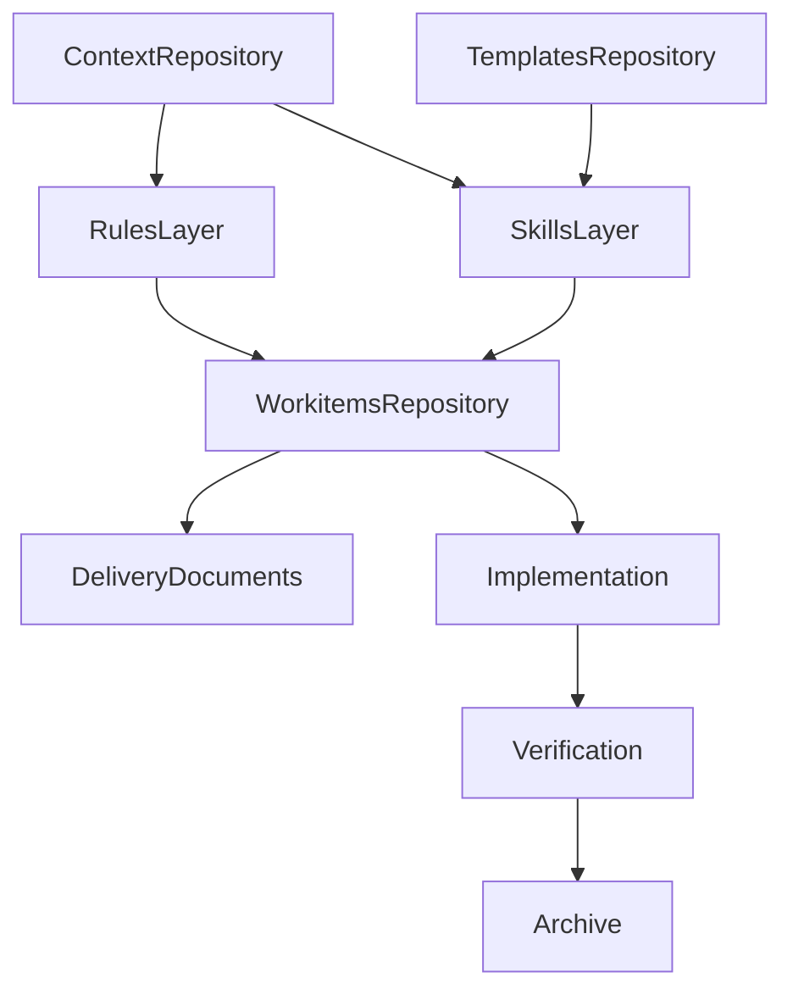
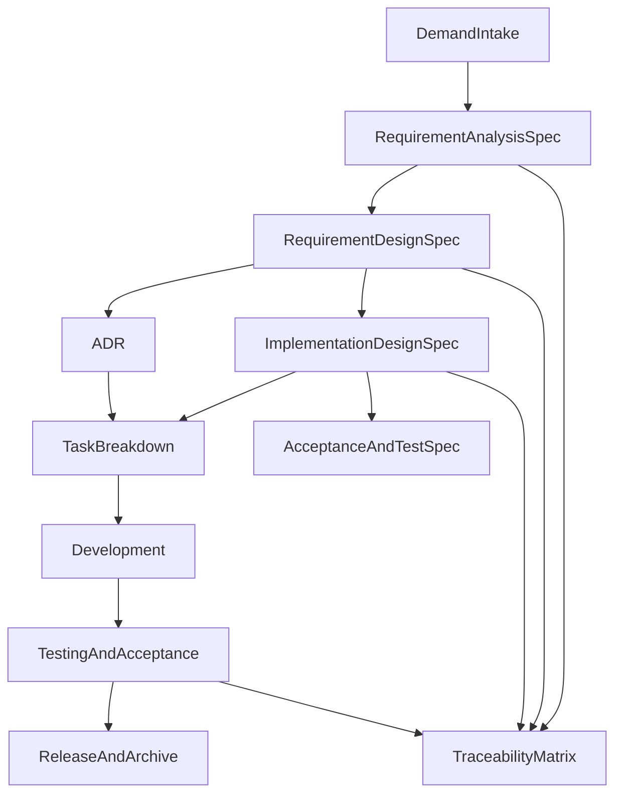

# SDD 脚手架完整设计方案

## 1. 文档说明

本文档用于设计一套面向团队协作的软件开发脚手架工程。该脚手架以规范驱动开发（Spec-Driven Development, SDD）为核心思想，目标是将团队既有交付件体系、AI Agent 作业方式、规则约束、模板资产和上下文工程整合为一套可持续演进的工程体系。

本文档聚焦设计方案本身，不直接展开具体文件落地实现。后续脚手架工程的目录、文件、模板、规则和技能，均应以本文为上位设计依据。

## 2. 背景与目标

### 2.1 背景

在传统软件开发流程中，需求、设计、实现和测试之间经常存在以下断层：

- 需求描述和实现之间缺少稳定映射，导致偏题开发。
- 设计文档与实际代码逐渐脱节，后期难以追踪。
- 团队交付件种类固定，但内容质量和颗粒度不一致。
- AI 工具虽然能提升局部效率，但若缺乏统一规则和上下文，容易造成跳步骤、遗漏边界、忽视验收标准等问题。

SDD 的核心价值在于把“规格”从静态文档提升为交付过程中的主线资产，使需求、设计、任务、实现、测试和发布围绕同一套规格系统运行。

### 2.2 设计目标

本方案希望实现以下目标：

- 与团队既有交付件对齐，保留 `需求分析说明书`、`需求设计说明书`、`软件实现设计说明书` 作为主说明书。
- 在不重复建设的前提下，引入 SDD 所需的 `ADR`、`任务分解说明`、`验收与测试说明`、`追踪矩阵`、`发布与变更说明`。
- 形成适合 Cursor Agent 使用的 `rules`、`skills`、`templates` 和 `context` 体系。
- 使 AI 能够按照团队流程生成、审查、追踪和回填交付件，而不是只完成片段式写作或编码。
- 使整个流程具备阶段门禁、追踪闭环和治理留痕能力。

## 3. 设计原则

### 3.1 规格优先

任何开发活动原则上应先有规格，再有任务，再有实现。复杂实现不得跳过上游规格直接推进。

### 3.2 单一事实源

每类信息只在一个主文档中被完整定义。其他文档只做引用、展开、分解或验证，不重复抄写。

### 3.3 分层治理

规则、技能、模板和上下文必须分层设计，避免“大一统说明书”式堆叠。

### 3.4 人机协同

文档必须同时适合人工评审和 AI 生成。模板既要结构化，也要保留人工决策空间。

### 3.5 可追踪与可审计

任何需求项、设计项、实现项、测试项和发布项都应可追溯；关键决策、例外处理和风险也应留痕。

### 3.6 渐进演进

脚手架要支持先建制度骨架，再逐步补齐模板、示例、自动化检查和领域适配，而不是一次性写满全部内容。

## 4. 整体架构

脚手架由 5 个核心子系统组成：

- `rules`：定义 Agent 的工作边界、阶段门禁、文档质量和追踪要求。
- `skills`：定义 Agent 在不同阶段的具体作业能力。
- `templates`：定义团队标准交付件和配套文档模板。
- `context`：定义长期稳定且跨需求复用的业务、产品、架构和流程知识。
- `workitems`：定义每次需求或项目的实例化工作目录。



## 5. 文档体系设计

### 5.1 主说明书体系

围绕团队既有交付件，建议保留以下 3 份主说明书作为规格主干：

1. `需求分析说明书`
2. `需求设计说明书`
3. `软件实现设计说明书`

三者关系如下：

- `需求分析说明书` 负责定义问题、目标、边界和价值。
- `需求设计说明书` 负责定义面向业务与功能的设计方案。
- `软件实现设计说明书` 负责定义面向落地实现的技术设计。

### 5.2 SDD 补充文档体系

在三类主说明书之外，建议引入以下 5 类 SDD 配套文档：

- `ADR`
- `任务分解说明`
- `验收与测试说明`
- `追踪矩阵`
- `发布与变更说明`

这些文档不替代主说明书，而是填补主说明书无法高效承担的决策、分解、验证和归档职责。

### 5.3 文档职责边界

为避免重复建设，建议严格定义各文档边界。

#### 需求分析说明书

负责回答：

- 为什么做
- 解决什么问题
- 覆盖哪些范围
- 不覆盖哪些范围
- 成功标准是什么

不负责回答：

- 详细技术实现结构
- 具体编码任务拆分
- 详细测试设计

#### 需求设计说明书

负责回答：

- 功能如何组织
- 业务流程如何设计
- 交互、接口、规则如何定义
- 不同方案如何比较和取舍

不负责回答：

- 过于底层的模块实现细节
- 任务排期和责任拆解
- 完整的技术决策留痕

#### 软件实现设计说明书

负责回答：

- 模块如何划分
- 接口和数据结构如何定义
- 异常处理、配置、部署、测试设计如何考虑

不负责回答：

- 重复描述需求背景
- 重新做业务方案对比
- 取代任务和测试跟踪文档

#### ADR

负责记录重大设计或实现决策，强调“为什么选这个方案，而不是其他方案”。

#### 任务分解说明

负责把已确定的设计分解为可执行任务、依赖关系、完成定义和验证动作。

#### 验收与测试说明

负责定义验证标准、验证方法、测试分层、证据要求和通过条件。

#### 追踪矩阵

负责维护 `需求 -> 设计 -> 实现 -> 测试 -> 证据` 的映射关系。

#### 发布与变更说明

负责沉淀版本范围、发布步骤、影响面、回滚方案和已知问题。

### 5.4 与业界常见文档的映射

- `需求分析说明书` 对应外部常见 `PRD` 的主体职责。
- `需求设计说明书` 对应外部常见 `RFC`、`功能设计`、`方案设计` 的主体职责。
- `软件实现设计说明书` 对应外部常见 `Technical Design`、`Implementation Design` 的主体职责。
- `ADR`、`追踪矩阵`、`验收与测试说明` 是 SDD 强化文档，不是额外叠加的第四套设计体系。

## 6. 流程模型设计

建议将研发流程抽象为以下 7 个阶段：

1. 需求受理
2. 需求分析
3. 需求设计
4. 实现设计
5. 开发实现
6. 测试验收
7. 发布归档

对应的输入输出关系如下：



### 6.1 阶段门禁建议

- 未形成 `需求分析说明书`，不得进入正式需求设计。
- 未形成 `需求设计说明书`，不得进入复杂实现设计与主要开发。
- 未形成 `软件实现设计说明书` 和必要 `ADR`，不得开展高风险编码工作。
- 未形成 `任务分解说明` 与 `验收与测试说明`，不得进入正式提测。
- 未补齐 `追踪矩阵` 和验证证据，不得宣布需求关闭。

## 7. 仓库结构设计

建议采用如下仓库结构：

```text
.
├── .cursor/
│   ├── rules/
│   └── skills/
├── templates/
│   ├── specs/
│   ├── governance/
│   └── checklists/
├── context/
│   ├── business/
│   ├── product/
│   ├── architecture/
│   ├── engineering/
│   └── process/
├── workitems/
├── examples/
└── sdd-scaffold-design.md
```

### 7.1 目录职责

- `.cursor/rules/`：存放项目级规则文件。
- `.cursor/skills/`：存放项目级技能目录。
- `templates/specs/`：存放主说明书和 SDD 配套文档模板。
- `templates/governance/`：存放追踪矩阵、发布说明等治理文档模板。
- `templates/checklists/`：存放阶段关口和文档评审检查清单。
- `context/`：存放长期稳定上下文。
- `workitems/`：存放单个需求或项目的实例化资产。
- `examples/`：存放高质量示例，供模板和技能引用。

## 8. Skills 分层设计

### 8.1 设计目标

`skills` 不能简单按文档类型平铺，否则随着流程扩展会迅速失控。建议采用分层结构，把“作业方法”拆成可组合能力。

建议分为 5 层：

1. 平台基础层
2. 流程执行层
3. 文档生产层
4. 治理审查层
5. 领域适配层

### 8.2 平台基础层

该层解决脚手架级别的通用操作规范，负责 workitem 初始化、上下文装载、模板应用和追踪更新。

建议技能：

- `bootstrap-workitem`
- `load-context`
- `apply-template`
- `update-traceability`
- `manage-identifiers`

职责说明：

- 新建需求实例目录
- 生成基础编号和主文档占位
- 根据阶段装载必要上下文
- 为下游技能提供统一输入输出结构

### 8.3 流程执行层

该层围绕研发阶段推进，负责指导 Agent 按流程运行，而非只生成单份文档。

建议技能：

- `intake-demand`
- `run-analysis-phase`
- `run-design-phase`
- `run-implementation-design-phase`
- `run-acceptance-phase`
- `prepare-release-phase`

职责说明：

- 判断阶段输入是否充分
- 调用对应模板与文档技能
- 识别缺失项并提醒补件
- 在阶段切换时更新追踪和状态

### 8.4 文档生产层

该层直接面向交付件生成和修订，是使用最频繁的一层。

建议技能：

- `create-requirement-analysis-spec`
- `create-requirement-design-spec`
- `create-implementation-design-spec`
- `record-adr`
- `create-task-breakdown`
- `create-acceptance-test-spec`
- `create-release-note`

职责说明：

- 从输入材料生成初稿
- 对照模板填充缺项
- 引用上游文档编号
- 保持术语、章节和编号一致

### 8.5 治理审查层

该层用于控制完整性、追踪性和合规性，不一定高频，但对质量非常关键。

建议技能：

- `review-document-completeness`
- `review-traceability`
- `review-acceptance-coverage`
- `review-design-conflicts`
- `audit-stage-gate`
- `review-release-readiness`

职责说明：

- 检查文档章节是否完整
- 检查需求项是否被设计、实现和测试覆盖
- 检查设计冲突和上下文矛盾
- 检查是否满足进入下一阶段的门禁条件

### 8.6 领域适配层

该层用于在不修改主体系的前提下，对接具体业务场景、行业规范和产品线差异。

建议技能：

- `domain-workflow-system`
- `domain-b2b-enterprise`
- `domain-integration-heavy-system`
- `domain-regulated-delivery`

职责说明：

- 注入行业术语
- 注入业务规则
- 调整模板关注点
- 对特定领域增加检查项

### 8.7 分层调用关系

- 平台基础层负责标准化输入输出。
- 流程执行层负责驱动阶段推进。
- 文档生产层负责生成交付件。
- 治理审查层负责检查质量和关口。
- 领域适配层负责注入场景差异。

该分层设计可以保证脚手架在业务扩展时主要增加领域层和部分模板，而不必重写整个流程系统。

## 9. Rules 体系设计

### 9.1 设计目标

`rules` 的作用不是复制编码规范，而是对 Agent 施加稳定、可组合、可持续维护的项目级约束。

建议规则体系按 6 类组织：

1. 全局工作方式规则
2. 阶段门禁规则
3. 文档质量规则
4. 实现约束规则
5. 测试与验收规则
6. 审计与归档规则

### 9.2 各类规则说明

#### 全局工作方式规则

建议文件：`00-agent-operating-model.mdc`

作用：

- 明确 Agent 必须优先读取上下文和上游文档
- 明确先规格、后任务、再实现的原则
- 明确输出应引用模板和编号

#### 阶段门禁规则

建议文件：`10-stage-gates.mdc`

作用：

- 定义每个阶段的输入要求
- 定义每个阶段的输出要求
- 禁止跨阶段绕行

#### 文档质量规则

建议文件：`20-spec-writing-quality.mdc`

作用：

- 统一章节结构、编号方式和术语用法
- 强制要求写出非目标、风险、边界、依赖
- 明确何处应引用上游文档

#### 实现约束规则

建议文件：`30-implementation-guardrails.mdc`

作用：

- 要求代码实现引用对应 workitem 和规格来源
- 要求完成后回填设计、任务和验证信息
- 要求高风险修改先补 ADR 或实现设计

#### 测试与验收规则

建议文件：`40-verification-traceability.mdc`

作用：

- 要求每个需求项至少对应一个验收项
- 要求验收项具有验证方式和证据要求
- 要求测试结果可以追溯到需求编号

#### 审计与归档规则

建议文件：`50-governance-and-archive.mdc`

作用：

- 要求关键决策、例外处理和已知风险留痕
- 要求发布与归档输出完整
- 要求需求关闭前完成追踪检查

### 9.3 规则编写原则

- 单文件单主题
- 内容短小可组合
- 只写团队特有知识，不重复通用编程常识
- 复杂内容通过 `@模板` 或 `@context` 文件引用
- 把格式性内容尽量交给模板和检查清单承担

## 10. Templates 体系设计

### 10.1 模板分类

建议把模板分成 3 组：

- 主说明书模板
- SDD 配套模板
- 治理与检查清单模板

### 10.2 主说明书模板

#### 需求分析说明书模板

建议章节：

- 文档目的
- 背景与问题定义
- 业务目标
- 非目标
- 范围
- 用户角色
- 业务场景
- 关键约束
- 成功标准
- 风险与待澄清问题

#### 需求设计说明书模板

建议章节：

- 设计目标
- 需求映射
- 功能设计
- 业务流程设计
- 交互规则
- 接口影响
- 数据规则
- 方案比较与取舍
- 风险与边界
- 待确认事项

#### 软件实现设计说明书模板

建议章节：

- 设计目标
- 实现范围
- 模块划分
- 组件职责
- 数据模型
- 接口契约
- 异常处理
- 配置与部署影响
- 测试设计
- 回滚思路

### 10.3 SDD 配套模板

#### ADR 模板

建议章节：

- 状态
- 上下文
- 备选方案
- 决策
- 影响
- 关联文档

#### 任务分解模板

建议章节：

- 任务编号
- 任务目标
- 输入来源
- 前置依赖
- 输出物
- 完成定义
- 验证动作

#### 验收与测试说明模板

建议章节：

- 需求编号
- 验收标准
- Given / When / Then
- 测试类型
- 前置条件
- 证据要求
- 风险备注

#### 追踪矩阵模板

建议字段：

- 需求编号
- 设计章节
- 实现章节
- 任务编号
- 测试编号
- 状态
- 证据链接

#### 发布与变更说明模板

建议章节：

- 版本范围
- 变更摘要
- 影响面
- 发布步骤
- 验证步骤
- 回滚步骤
- 已知问题

### 10.4 检查清单模板

建议提供以下清单：

- 阶段门禁清单
- 文档完整性清单
- 设计评审清单
- 验收覆盖清单
- 发布准备清单

### 10.5 模板设计要求

- 每份模板都要说明适用场景、输入依赖和输出位置。
- 所有可追踪对象必须保留编号位。
- 模板中应有“缺项提示”，便于 Agent 检查空缺。
- 模板内容既适合人工填写，也适合 AI 自动生成初稿。

## 11. Context 工程设计

### 11.1 目标

`context` 负责承载长期稳定且跨需求复用的信息，是脚手架的共享记忆层。

### 11.2 分层结构

建议拆为 5 类：

#### 业务上下文

- `domain-overview.md`
- `business-rules.md`

内容包括：

- 业务域边界
- 核心业务对象
- 关键业务规则
- 禁止违反的业务约束

#### 产品上下文

- `personas.md`
- `glossary.md`

内容包括：

- 用户角色
- 术语定义
- 关键业务动作说明

#### 架构上下文

- `system-overview.md`
- `integration-map.md`

内容包括：

- 系统边界
- 关键模块关系
- 外部系统集成
- 技术约束

#### 工程上下文

- `tech-stack.md`
- `repo-conventions.md`

内容包括：

- 技术栈
- 仓库结构约定
- 测试与构建习惯
- 代码组织方式

#### 流程上下文

- `stage-gates.md`
- `review-checklists.md`

内容包括：

- 阶段进入条件
- 阶段输出标准
- 评审角色
- 审核关注点

### 11.3 上下文边界原则

- 稳定且跨项目复用的信息进入 `context/`。
- 仅对单个需求有效的信息进入 `workitems/<id>/`。
- 过期、替代或已废弃知识不应长期滞留在主上下文中。

## 12. Workitem 实例化设计

每个需求或项目建议建立独立 workitem 目录，例如：

```text
workitems/<id>/
├── 00-intake.md
├── 01-requirement-analysis-spec.md
├── 02-requirement-design-spec.md
├── 03-implementation-design-spec.md
├── 04-adrs/
├── 05-task-breakdown.md
├── 06-acceptance-test-spec.md
├── 07-release-note.md
├── traceability.md
└── evidence/
```

### 12.1 目录作用

- `00-intake.md`：记录需求来源和初始输入。
- `01-requirement-analysis-spec.md`：记录需求分析说明书。
- `02-requirement-design-spec.md`：记录需求设计说明书。
- `03-implementation-design-spec.md`：记录软件实现设计说明书。
- `04-adrs/`：记录一条或多条 ADR。
- `05-task-breakdown.md`：记录实施拆解。
- `06-acceptance-test-spec.md`：记录验收与测试说明。
- `07-release-note.md`：记录发布与变更说明。
- `traceability.md`：记录完整追踪链路。
- `evidence/`：沉淀测试截图、报告、输出结果等证据。

### 12.2 追踪矩阵要求

`traceability.md` 应作为 workitem 核心资产，至少维护以下映射：

- 需求编号 -> 需求设计章节
- 需求编号 -> 实现设计章节
- 需求编号 -> 任务编号
- 需求编号 -> 验收编号
- 验收编号 -> 证据位置

## 13. 治理机制设计

为了确保脚手架不是单纯的文档生成器，还应配套治理机制。

### 13.1 评审机制

- `需求分析说明书` 应明确业务评审责任人。
- `需求设计说明书` 应明确产品、业务和技术共同评审责任人。
- `软件实现设计说明书` 应明确技术评审责任人。
- `ADR` 应明确决策批准责任人。

### 13.2 编号机制

建议统一以下编号体系：

- 需求编号：`REQ-xxx`
- 设计项编号：`DES-xxx`
- 实现项编号：`IMP-xxx`
- 任务编号：`TASK-xxx`
- 验收编号：`ACC-xxx`
- ADR 编号：`ADR-xxx`

### 13.3 状态机制

建议统一状态流转：

- 草稿
- 评审中
- 已接受
- 已实现
- 已验证
- 已归档

### 13.4 变更机制

- 任一需求发生范围变化时，必须评估受影响文档。
- 重大方案变化应新增或更新 ADR。
- 验收标准变化必须同步更新追踪矩阵。
- 发布前必须确认文档状态与实际实现一致。

### 13.5 审计机制

以下信息应可追溯：

- 谁提出了需求
- 谁批准了设计
- 谁做出了关键决策
- 哪些风险被接受
- 哪些需求项已验证
- 哪些问题留待后续处理

## 14. 演进路线

建议分 3 期推进：

### 第一期：制度骨架

目标：

- 建立仓库结构
- 建立三类主说明书模板
- 建立基础规则和基础技能

### 第二期：闭环增强

目标：

- 补齐 ADR、任务分解、验收说明、追踪矩阵模板
- 补齐治理审查类技能
- 建立阶段门禁和检查清单

### 第三期：可扩展化

目标：

- 增加示例库
- 引入领域适配层技能
- 增加自动审查和归档能力
- 逐步沉淀团队最佳实践

## 15. 验收标准

本方案对应的脚手架最终应满足以下标准：

- 团队能够围绕三类主说明书稳定地产出交付件。
- `skills` 形成分层体系，并可针对不同业务线扩展。
- SDD 补充文档与主说明书之间边界清晰，没有明显职责重叠。
- `rules` 能约束 Agent 避免绕过上游规格直接编码。
- 任一需求都可以从分析、设计、实现、测试到证据形成闭环。
- 模板、规则和上下文可以版本化维护并在团队内复用。

## 16. 后续落地建议

本文档完成后，下一步建议依次开展以下工作：

1. 将本方案转化为实际仓库目录和文件骨架。
2. 优先落地三类主说明书模板与 `ADR`、`追踪矩阵` 模板。
3. 建立首批基础规则和分层技能。
4. 用一个真实需求跑通完整流程，再反向修正模板和规则。

